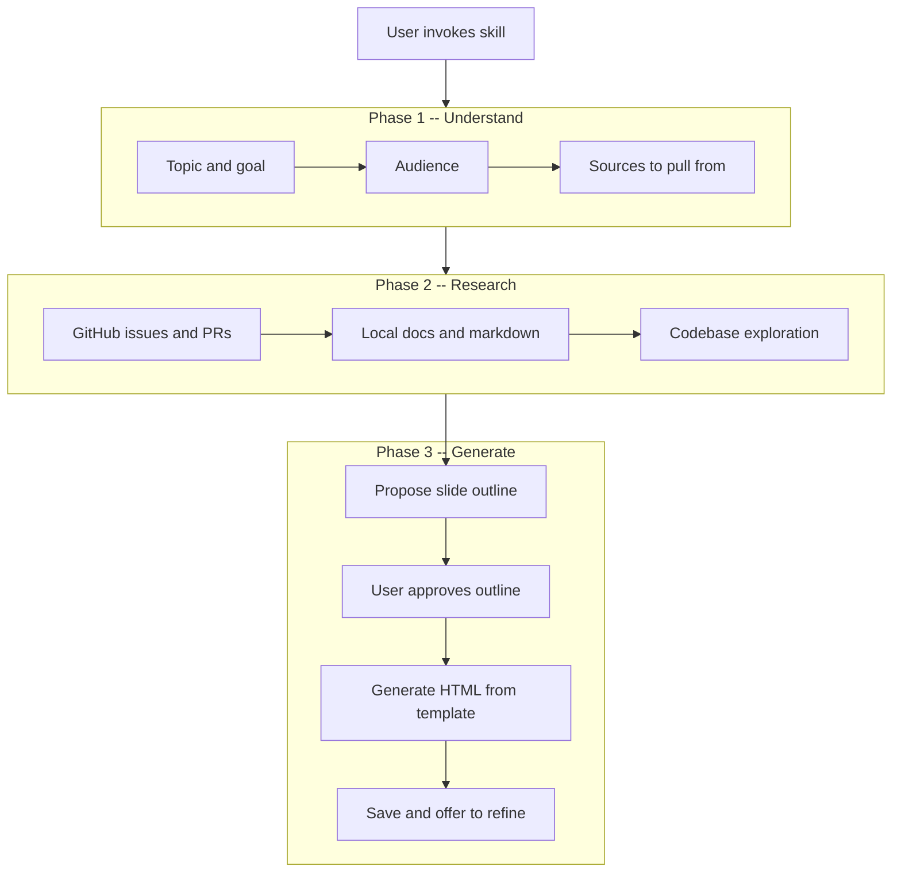

# skill-presentation

An [agent skill](https://skills.sh) that generates interactive HTML slide deck presentations on any topic. Describe what you want to present, and it researches the content, proposes a slide outline, and generates a polished, self-contained HTML deck with arrow navigation, fullscreen mode, swipe support, progress bar, dot navigation, scroll navigation, and print-to-PDF.

## Install

```bash
npx skills add davethegut/presentation-skill
```

Works with [Cursor](https://cursor.com), [Claude Code](https://code.claude.com), [Codex](https://developers.openai.com/codex), [Windsurf](https://windsurf.com), [Cline](https://cline.bot), [GitHub Copilot](https://github.com/features/copilot), [Roo Code](https://roocode.com), and [40+ other agents](https://skills.sh/docs/cli).

## How It Works

The skill runs a **5-step pipeline** — understand the ask, research sources, propose a slide outline for approval, generate the deck from a template, and deliver.



The research phase is optional — if you provide all the content upfront (a markdown doc, a GitHub issue, pasted text), the skill skips straight to outlining.

## Slide Component Library

The skill picks from **12 slide types** based on your content. There is no fixed sequence — slide selection is content-driven.

| # | Component | Best For |
|---|-----------|----------|
| 1 | **Title** | Hero opening with gradient text, tags, date |
| 2 | **Stat Cards** | Big numbers or keywords that anchor a point |
| 3 | **Before / After** | Contrasting current vs. proposed state |
| 4 | **Pipeline / Flow** | Processes, architectures, data flows |
| 5 | **Data Table** | PRs, issues, feature matrices, metrics |
| 6 | **Feature Grid** | Ecosystem connections, related items |
| 7 | **Quote Gallery** | Customer evidence, stakeholder statements |
| 8 | **Content Cards** | Feature breakdowns, categorized info |
| 9 | **Timeline** | Roadmaps, milestones, delivery plans |
| 10 | **Two-Column Wrap-Up** | Problem/solution summaries |
| 11 | **Big Statement** | The "so what" moment, closing punch |
| 12 | **Narrative** | Background context (use sparingly) |

Plus utility elements: callouts, source notes, tags, and footer attribution.

## Common Patterns by Goal

| Goal | Typical slide flow |
|------|-------------------|
| **Persuade** | Title → Problem → Before/After → Architecture → Evidence → Impact → Momentum → Plan → Ask |
| **Inform/Teach** | Title → Context → Concepts → Architecture → Deep-dive → Examples → Summary |
| **Update/Report** | Title → Summary → Metrics → Progress → Blockers → Next Steps |
| **Propose** | Title → Problem → Opportunity → Solution → Feasibility → Tradeoffs → Ask |

## Features

Every generated deck includes:

- **Arrow key navigation** — left/right, up/down, Home/End
- **Fullscreen mode** — press F or click the fullscreen button
- **Swipe support** — touch-based navigation for mobile/tablet
- **Scroll navigation** — mouse wheel advances slides
- **Progress bar** — gradient bar at the top shows position
- **Dot navigation** — clickable dots at the bottom for direct access
- **Print-to-PDF** — press P for a print-optimized layout with page breaks
- **Responsive design** — adapts to mobile screens automatically
- **Dark theme** — polished dark aesthetic with configurable color tokens
- **No external dependencies** — works offline, shareable as a single file

## Prerequisites

- **`gh` CLI** (optional) — only needed if the skill researches GitHub issues/PRs for content. Verify with `gh auth status`.

## Installation

### Via skills.sh (recommended)

```bash
npx skills add davethegut/presentation-skill
```

The CLI auto-detects which agents you have installed and offers to install to each one. Use flags for non-interactive installation:

```bash
# Install to a specific agent
npx skills add davethegut/presentation-skill -a cursor -y

# Install globally (available to all projects)
npx skills add davethegut/presentation-skill -g

# Install to all detected agents
npx skills add davethegut/presentation-skill --all
```

### Manual installation

Clone the repo and copy into your agent's skills directory:

```bash
git clone https://github.com/davethegut/presentation-skill.git

# Cursor
cp -r presentation-skill ~/.cursor/skills/skill-presentation

# Claude Code
cp -r presentation-skill ~/.claude/skills/skill-presentation

# Or any agent's skills directory
```

### Verify installation

Confirm that `SKILL.md`, `template.html`, and `components.md` are all readable at the installed path.

## Usage

Ask the skill to create a presentation. It will infer the goal and audience from context, or ask if ambiguous.

### Persuade stakeholders

```
Create a presentation about why we should invest in the alert pipeline initiative
```

### Report on progress

```
Build a deck summarizing Q1 security AI progress for the team
```

### Turn existing content into slides

```
Turn this markdown doc into a presentation
```

### Teach a concept

```
Make slides explaining how Attack Discovery works for new engineers
```

### What to Expect

1. The skill asks about the topic, goal, and audience (or infers from context)
2. It researches sources if pointed to GitHub issues, docs, or data
3. It proposes a slide outline with types from the component library
4. **You approve or adjust the outline before generation**
5. It generates a self-contained HTML deck from the template
6. You receive the file and an offer to refine

## Output Format

Presentations are generated as self-contained HTML files. See [`examples/sample-presentation-output.html`](examples/sample-presentation-output.html) for a complete example.

## Customizing the Template

Edit [`template.html`](template.html) to change the look and feel. The template uses CSS custom properties — adjust colors, fonts, or spacing:

```css
:root {
  --elastic-blue: #0B64DD;
  --elastic-purple: #731DCF;
  --elastic-teal: #00BFB3;
  --elastic-pink: #F04E98;
  --elastic-yellow: #FEC514;
  --bg-primary: #0a0e1a;
  --bg-card: #1a2236;
  --text-primary: #f0f2f5;
  --text-secondary: #94a3b8;
}
```

The slide component patterns are in [`components.md`](components.md) — add new slide types there.

## Security

The skill includes security rules from a [formal security review](https://github.com/davethegut/presentation-skill/blob/main/SKILL.md#rules):

- **No fabricated statistics** — every stat must cite a traceable source, or use `[DATA NEEDED]` placeholder
- **URL protocol validation** — only `https://` URLs in href attributes
- **`rel="noopener noreferrer"`** on all external links
- **HTML-entity encoding** for content sourced from external systems
- **Google Fonts opt-in** — commented out by default to prevent viewer IP leakage

## Limitations

- **Does not create images or screenshots.** All visuals are HTML/CSS/SVG.
- **Best for 8-14 slides.** Longer decks lose audience attention; shorter ones may lack depth.
- **Single-topic focus.** Each invocation generates one presentation on one topic.
- **Content quality depends on sources.** The skill synthesizes what it finds — better inputs produce better decks.

## Repository Structure

```
├── SKILL.md              # Main skill definition — workflow, slide selection, rules
├── AGENTS.md             # Claude Code / Codex compatibility layer
├── template.html         # Self-contained HTML deck engine with all CSS/JS inline
├── components.md         # 12 slide type patterns with copy-paste HTML
└── examples/
    └── sample-presentation-output.html   # Example of a generated presentation
```

## License

[MIT](LICENSE)
